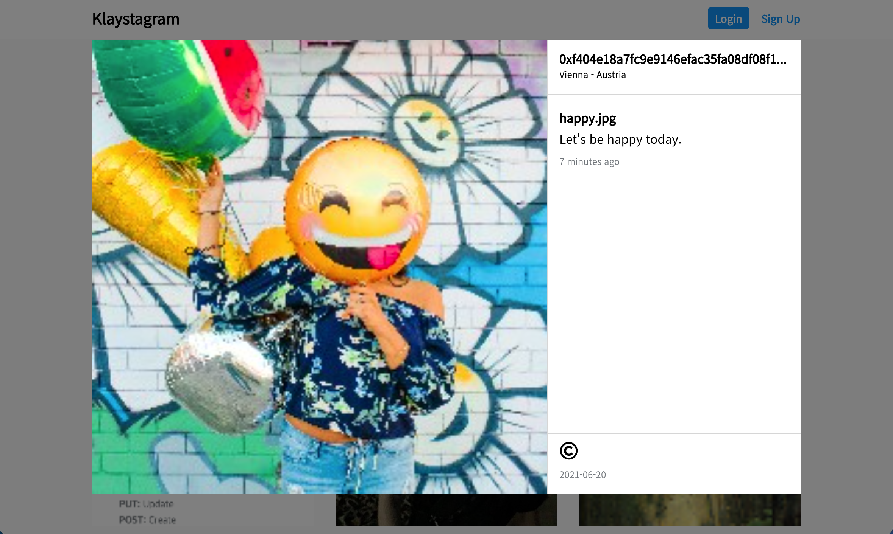

# [Klaystagram](https://klaystagram.vercel.app/)

Klaytn 블록체인을 활용하여 만든 인스타그램 클론 📸

기존 Klaytn에서 제공한 Klaystagram 예제를 수정하여 작성하였습니다.

## 개발 환경

- Klaytn(caver.js)
- Typescript
- React + Next.js
- Redux
- Emotion

## 기존 Klaystagram와 다른점

- Typescript 적용
- Redux를 ducks 패턴으로 작성
- SCSS를 Css in Js로 변경(Emotion)
- Class문법으로 작성된 React를 Hooks문법으로 변경
- Next.js프레임워크 적용
- Promise를 async await로 변경
- Moment를 date-fns로 변경(Moment는 더이상 업데이트 되지 않습니다.)
- HTML구조를 좀 더 시멘틱하게 변경
- 잘못된 링크 주소 변경
- caver.js의 스펙이 변경됨에 따라 달라진 부분 수정
- 좀 더 인스타그램스럽게 디자인 변경

## 아직 미흡한 부분

- 웹 접근성
